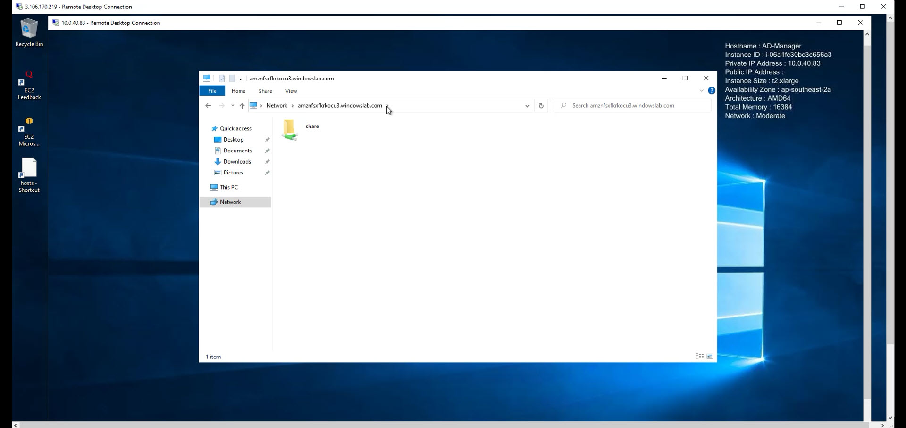
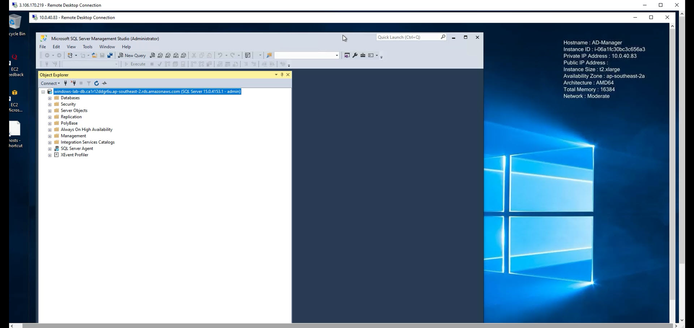
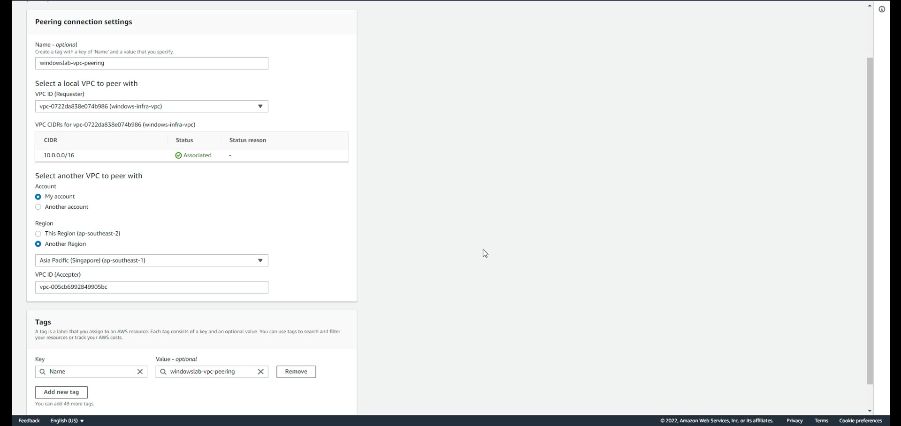
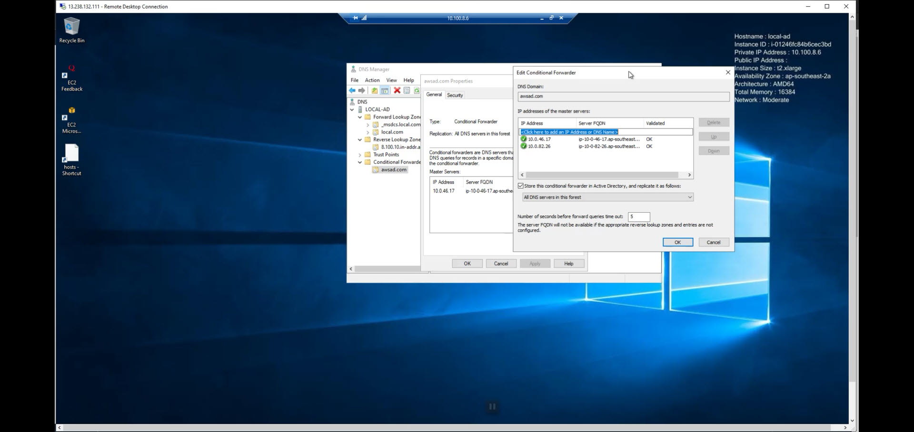

# AWS Windows Infrastructure 
## Lời Nói Đầu: 

 - Tất cả các bài lab đều được thực hiện dựa theo giải pháp của AWS về
   xây dựng hệ thống mạng đạt chuẩn.
 - Link giải pháp AWS: [Giải Pháp Windows Trên
   AWS](https://aws-labs.net/winlab0-buildinfra.html)
 - Các bài lab/giải pháp sẽ dịch ngược sơ đồ hệ thống thành step by step
   để giải trình cách làm
 - Nếu như muốn tham khảo file Infrastructure as Code (IaC) thì có thể
   truy cập đường dẫn đã cung cấp phía trên khi thực hiện xong. 
 - Xin lưu ý hãy xóa hết tất cả những dữ liệu đã làm để tránh chi phí
   AWS không  cần thiết. 
 - Đây sẽ là những bài lab/giải pháp típ nối nhau thành 1 chuỗi các bài
   lab nhằm cung cấp đầy đủ nhất có thể được về việc triển khai hệ thống
   Windows trên AWS

## Xây Dựng Hệ Thống Mạng Windows Trên AWS

 **I. Tổng quan sơ đồ mạng**
 

Nhìn vào sơ đồ mạng này, chúng ta sẽ thấy những thành phần sau:

 - AWS Cloud: đây là ý chỉ về dịch vụ cloud AWS
 - Availability Zone 1 & 2: Trong AWS, chúng ta hay gọi đây là AZ, tức
   là vùng có thể thực hiện việc xây dựng AWS. Có nhiều vùng khác nhau.
   Thí dụ như ở VN, thì gần nhất là có - **Asia Pacific  (Singapore)
   ap-southeast-1** và  -  **Asia Pacific  (Sydney) ap-southeast-2**. Chính
   xác hơn thì đây là 2 region. Trong 2 region này sẽ có các AZ. Các AZ
   có thể hiểu nôm na như là 1 trung tâm dữ liệu (datacentre) vật lý của
   AWS. 
 - Vậy thì dựa vào giải thích trên, ta có thể hiểu rằng AWS hiện tại có
   vùng sử dụng được là Singapore và trong đó có 1 datacentre của AWS.
 - Thứ tự 1 và 2 ở trên không mang lên ý nghĩa gì khác ngoài việc đánh
   số thứ tự của AWS. Nó không có nghĩa là ở Sing có 1 DC và ở Úc có 2
   DC. 
 - Hay nói cách khác, AWS phân rộng hơn các region (vùng), thì dựa vào 2
   thí dụ trên, ta có thể hiểu được 1 cách rộng ra rằng AWS đánh số thứ
   tự cho vùng lớn là Châu Á - Thái Bình Dương. Trong vùng lớn này có 2
   (thí dụ) DC đánh số thứ tự để dễ quản lý lần lượt là
   **ap-southeast-1** và **ap-southeast-2**
 - Vậy thì phân vùng trong kiến trúc có quan trọng hay không. Câu trả lời là có. Vì nó thể hiện được sự bền vững trong việc xây dựng giải pháp. Thí dụ như on-premise, các bạn xây dựng hệ thống chúng ta thường hay có fail-over và load-balancing nằm trên 2 dải ip để chạy song song. Thì AWS cũng vậy, hãy hiểu rằng AZ nó cũng như việc chúng ta phân dảy IP để thực hiện công việc load balancing và fail-over. 
 - Ngoài ra, khi thực hiện đến việc Active Directory, AWS sẽ bắt buộc  chúng ta thiết kế đúng chuẩn là phải có ít nhất 2 AZ để triển khai AWS Mamaged AD. Hoặc chúng ta có thể tham khảo AD Connector của AWS để triển khai giải pháp Hybird AD : On-premise <=> AWS. Lưu ý là vẫn phải trả phí cho AD Connector. 
 - VPC - Virtual Private Cloud: Theo lý thuyết của AWS, đây là nơi mà sẽ **logically separate your infrastructure**. Có nghĩa là nó như 1 cái DMZ ảo, bao quát toàn bộ kiến trúc của bạn. Và trong này, bạn có thể thiết lập các policy nhằm chặn/mở các cổng/giao thức cần thiết cho kiến trúc. Mặc định, VPC sẽ chặn mọi truy cập từ trong ra và từ ngoài vào. Nó tương tự như bạn setup software firewall. Khi set-up xong, cũng sẽ mặc định chặn hết. Bạn phải configure hợp lý để có thể tiến hành triển khai hệ thống dịch vụ.
 - Internet Gateway (IGW): thành phần này có nhiệm vụ kết nối 1 dãy ip của kiến trúc ra ngoài internet và biến nó thành Public IP Range. Tất cả các dịch vụ nằm trong dảy Public IP này sẽ kết nối đc với Internet
 - Public Subnet: Đây là dãy IP public dùng để ra internet của toàn bộ kiến trúc hệ thống. Để public được dãy IP này, bạn bắt buộc phải liên kết (associate) nó với IGW. Vì như đã giải trình ở trên, mặc định VPC là private. 
 - Private Subnet: Đây là dãy private IP. Mặc định khi tạo xong 1 dãy IP trong VPC, nó sẽ ở trạng thái private, trừ khi gắn vào IGW thì sẽ thành public ip.
 - NAT Gateway: Dùng để khai thông giao típ giữa các dịch vụ trong vùng: Private IP <=> Public IP
 - Auto Scaling Group (ASG): Đây là 1 tính năng rất hay mà khó lòng triển khai ở on-primes. Nó cho phép chúng ta cấu hình việc thêm máy chủ cho việc cân bằng tải vào giờ cao điểm, và giảm đi khi vào lúc bình thường nhằm tiết kiệm chi phí. On-premise, khi thực hiện việc này, xác định là sẽ rất tốn kém, vì chún ta không thể thêm hoặc bớt lượn máy chủ vật lý / ảo. Nhưng cái này làm được trên AWS nhờ vào ASG. 
 - Remote Desktop Gateway: đây là 1 bastion host dùng để truy cập từ nơi làm việc đến kiến trúc AWS của chúng ta. Còn gọi cách khác là jump-host. 
 
**II. Bắt đầu xây dựng hệ thống mạng**

**1. Cấu hình IAM Role:** 

AWS quản lý phân quyền rất chặt chẽ. Vì vậy, mỗi 1 resource trên AWS sẽ có những quyền hạn nhất định từ Denied All Access cho đến Allowed All Access. Ngoài ra, chúng ta cũng có thể dùng IAM để gán 1 số quyền nhất định nhằm thỏa mãn việc thiết kế architect best practices mà AWS đề ra: Least Privilege. Có nghĩa là phân quyền sao cho vừa đủ để thực hiện tác vụ ==> nhằm nâng cao độ an toàn cho toàn bộ hệ thống. 
- Vào AWS Management Console 
- Chọn IAM Role

- Chọn Roles => Create Role (góc phải trên)

- Chọn như hình => NEXT

- Chúng ta sẽ tìm và add các permission vào roles đang thực hiện. Lưu ý là khi tìm được 1 dịch vụ, bấm chọn, sau đó phải bấm X để Permission đó và tìm cái khác. Nếu không bấm X để xóa thì sẽ không tìm ra. Tương tự sẽ add tất cả các Permission như sau vào:

- Sẽ có tổng cộng là 5 Permissions như hình dưới. Sau đó bấm NEXT

- Sau đó sẽ là review lại roles, điền tên, thêm tag. Tùy chỉnh tùy ý. Sau cùng xuống dưới bấm Create. Vậy là đã có 1 Role bao gồm các Permissions đầy đủ để thực hiện công việc join domain.

**2. Thiết kế AWS Network** 

2.1: Tạo VPC
- Vào AWS Management Console, tìm VPC => Tại giao diện VPC => Create VPC

- Tạo 1 VPC như hình. Sau đó bấm Create

- Tại giao diện VPC vừa tạo, góc phải trên chúng ta bung thẻ Action ra => Edit DNS Host Name => Check Enable DNS Host Name => Save Change. 
- Làm tương tự cho DNS Resolution => Để phân giải tên domain/ip của chúng ta trên môi trường network

2.2: Tạo Subnet
- Tại VPC Management Console => Góc trái sẽ có những option => chọn Subnet => Create Subnet

- Tạo subnet như hình => Create subnet
- Các bạn nên vào trang web này [Tự Động Chia Subnet](https://www.davidc.net/sites/default/subnets/subnets.html) để phân chia subnet cho hiệu quả, tránh sai sót

- Tương tự như vậy, chúng ta sẽ có tổng cộng 4 Subnets trải đều trên 2 AZ. Theo hình mình làm sẽ là ap-southeast-2a và ap-southeast-2b. 
- Lần lượt sẽ là 1 public và 1 private trên mỗi AZ
- Tên subnets các bạn có thể đặt theo ý, miễn sao trực quan, dễ phân biệt và dễ thực hiện công việc là được. Nó hoàng toàn không có ý nghĩa gì và không liên quan hay ảnh hưởng gì đến môi trường network. 

2.3: Tạo Internet Gateway
- Như đã giải trình ở trên, 1 network trên AWS nằm trong VPC sẽ mặc định là private network, không thể ra internet được. Vì lẽ đó mà chúng ta cần phải có Internet Gateway để route traffic ra/vào 1 network chỉ định để làm thành Public Subnet.
- Tại VPC Management Console => Góc trái sẽ có những option => chọn Internet Gateway => Create Internet Gateway (IGW)

- Sau đó tạo 1 IGW => Create Internet Gateway

- Attach IGW to VPC

- Chọn VPC của bài lab này

2.4: Tạo Route Table
- Tại VPC Management Console => Góc trái sẽ có những option => chọn Route Table => Đã có 1 route có sẵn đó là do khi chúng ta tạo VPC thì SDN (Software Defined Network) của AWS sẽ định hình 1 route cho chúng ta. 
- Nên thực hiện việc đổi tên route này sao cho trực quan và dễ hiểu. Cách đổi tên thực hiện như hình dưới

- Tại route này => chọn Edit route 

- Chúng ta sẽ gắn vào IGW và route là 0.0.0.0/0 để đi ra internet => Save Changes

- Chúng ta cũng chọn route này => Action => Edit Sunet Association => Gắn vào 2  subnet đã tạo để chuyển hóa 2 subnets này thành 2 public subnets => Save Associations

- Tại phần Route Table Management Console => Góc phải => Create Route table => Tạo 1 private route table

- Chọn route table vừa mới tạo => Edit Subnet Association => Add 2 subnet còn lại vào => sẽ tạo thành 2 private subnet => Save Associations

2.5: Tạo NAT Gateway
- Để cho private subnet ra được internet. Chúng ta cần phải có 1 NAT Gateway. NAT Gateway này sẽ nằm ở phân vùng public subnet
- Tương tự như route table và internet gateway. Chúng ta chọn NAT Gateway ở menu bên trái => Create NAT Gateway
- Lưu ý là phải Allocate Elastic IP cho NAT Gateway

- NAT Gateway khởi tạo sẽ mất vài phút. Chúng ta đợi đến khi trạng thái từ Pending => Available là có thể sử dụng được. 
- Trở về Route Table => chọn Private Route => Edit Route

- Route 0.0.0.0/0 , gắn vào NAT Gateway để ra internet cho Private Subnet => Save Changes

**3. Thiết kế AWS Managed Active Directory Service (AWS Managed AD)** 
- AWS Management Console => Directory Service => Setup Directory

- Chọn như hình => NEXT

- Standard Edition, điền tên domain, password. Lưu ý là mặc định username của AWS Managed AD sẽ là Admin. Nên chúng ta chỉ cần setup password

- Chọn VPC và AZ. Lưu ý là AWS Managed AD bắt buộc phải có 2 AZ thì mới có thể khởi tạo được. Và nên tạo trong Private Subnet

- Chúng ta check lại thông tin và bấm Create Directory

- Sẽ mất khá lâu tầm 40 phút để cho AWS tạo các dịch vụ nền và promote AD.
- Chúng ta sẽ kiểm tra lại để xem AD có vào trạng thái Active hay chưa. Nếu trạng thái là Active thì có nghĩa là đã khởi tạo thành công. Một số trường hợp do underlied-host của AWS có vấn đề, nên có thể trạng thái AD sẽ là Failed. Nên kiểm tra chắc chắn lại.

**4. Thiết kế AWS EC2 và quản lý AWS Managed AD** 
- Tại AWS Management Console => EC2 => Launch Instances

- Chọn Windows Server 2022

- chọn t2.micro

- Tinh chỉnh setting cho EC2 như hình. Lưu ý là chúng ta sẽ phân tác vụ cho EC2 nên cần chọn chính xác các option. Theo hình thì EC2 này sẽ thực hiện tác vụ như 1 bastion-host (jump-host). Vì vậy sẽ ở Public Subnet, nhận  Public ip, joined domain và có IAM Role 

- Sau đó sẽ add storage => add theo tùy ý. Quan trọng là xong lab thì nhớ phải xóa hết tất cả resources

- Add Tag. Không nên bỏ qua phần này vì về sau system thật tế sẽ dùng Tag: Name-Value để quản lý, đặc biệt là việc thanh toán bill AWS. Ngoài ra thì khi có Tag, EC2 của bạn sẽ dễ dàng phân biệt và trực quan hơn.

- Sau đó là sẽ tạo Security Group (SG). Phục vụ cho mục đích bài lab. Chúng ta sẽ tạo SG đơn giản bằng cách All Traffic => Allow All. Nhưng đây KHÔNG phải là Security Best Practices. Khi môi trường công việc, nên thiết kế SG sao cho vừa đủ cần thiết xài là được. 

- Sau đó là Review & Launch. Tại bước này, AWS sẽ hỏi bạn việc khởi tạo public/private key cho EC2. Hình dưới minh họa việc đã có key và xài lại thì phải check dòng "Acknowledgement ...." 

- Minh họa cho việc tạo mới key. Thì bạn phài save key mới tạo về local thì sẽ xài được. Sau đó Launch Instance

- Tạo thêm 1 EC2 nữa như trên. Nhưng lưu ý những option sau: 

=> chọn Instance loại 2x.large: Lý do là EC2 này sẽ đảm nhiệm 1 số tác vụ cần đến sức mạnh phần cứng và tốc độ mạng tốt. Nếu chọn t2.micro thì sẽ xử lý khá lâu và có thể bị đơ trong quá trình làm
=> Private Subnet

=> Auto Assigned Public IP: DISABLE

=> chọn IAM Roles và AD đã tạo

=> Tag: Để tên là AD-Manager hoặc tên gì tùy ý bạn. Tên hoàng toàn không ảnh hưởng gì nhưng nó thể hiện trực quan chức năng của EC2. MIễn sao bạn không nhầm là được

=> Security Group: Chọn SG vừa mới tạo và SG có tên dxxxx_controller. Lý do vì đây là SG đặc biệt của AWS Managed AD tạo ra. 

- Sau đó chọn key và khởi tạo EC2 như cái vừa làm
- Mất 1 lúc để EC2 hoạt động được. Cho dù status: Checked Passed 2/2 nhưng cũng nên đợi 1~2 phút để cho instance hoàng thành việc warm-up thì mới log-in vào được.
- Để log-in vào 1 EC2, chọn EC2 đó => Connect => RDP Client

- Chúng ta có thể download file RDP hoặc xài public ip và RPD trên máy local cũng được. 
- Ngoài ra, chọn phần Get Password => Browse file RSA Key khi nãy vào và bấm Decrypt sẽ ra password cho bạn login. 
- Nếu bạn muốn login dạng domain thì: domain-name\Admin. Password là password đã khởi tạo ở phần AWS Managed AD

- Nếu bạn xài phần mềm RDP ở local thì có thể sử dụng Public IP như đã nói để login vào EC2. Lưu ý là, chỉ những EC2 ở phần Public Network mới có Public IP. Và những EC2 ở phần Private Network sẽ KO có Public IP, mà chỉ có Private IP.

- Vậy là đã log-in được từ Local => Bastion Host. Từ Bastion Host này, chúng ta sẽ login vào AD-Manager. Login theo phương thức domain

- Để hoàng thành việc quản lý AWS Managed AD. Chúng ta cần phải cài các dịch vụ cho EC2 AD-Manager. Các bạn làm Admin thì cũng không quá xa lạ gì với các dịch vụ này rồi
- Vào Server Management => Add Role & Features => Next đến Features (chúng ta không promote AD nên bỏ qua phần server roles): Group Policy Management, Remote Server Administration Tools => Role Administration Tools: AD AD & AD LDS, DNS Server Tools => NEXT 

- Mất 1 lúc để hoàng thành việc setup. Sau đó kiểm tra lại sẽ thấy những server tools quen thuộc. 
- Vậy là chúng ta đã hoàng thành việc quản trị AWS Managed AD trên EC2
 NEXT 

**5. Thiết kế AWS FSx - Windows** 
- AWS Management Console => Amazon FSx => Create File System

- FSx Windows => NEXT

- Đặt tên và setup như hình. Tên có thể tùy ý

- Các phần còn lại cứ để default. Sau đó NEXT => Xem lại option => Create File System
- Sẽ mất 1 khoảng thời gian tầm 40 phút để khởi tạo FSx
- chúng ta cũng nên check kĩ lưỡng để tránh trường hợp underlied-host của AWS có vấn đề. Khi thấy status là Available có nghĩa là FSx đã tạo xong và sẵn sàng sử dụng.

- Để tiến hành việc sử dụng FSx, chúng ta cần phải copy FSx DNS Name để tiến hành Map Network Drive. 
- Nhấp chọn FSx đã khởi tạo => Network & Security => FSx DNS Name nằm ở dưới

- Các bạn lưu ý 1 chỗ là mặc định, File & sharing sẽ turned-off để đảm bảo an toàn hệ thống. Chúng ta có thể turn-on hoặc trigger cho windows server tự động turn-on bằng cách: File Explorer => Nhấp vào Network => Bây giờ thì Windows sẽ hiện 1 thanh nhỏ hỏi chúng ta có turn-on File-Sharing trên môi trường Network hay không => Turn On
 
- FSx DNS Name khi nãy copy, bây giờ paste vào thanh address với cú pháp: \\FSx-DNS-Name => Enter => Sẽ truy cập đc vào FSx

- Chuột phải vào folder share => Map Network Drive => Tiến hành thực hiện Map Network Drive như bình thường. Sau khi xong chúng ta vào This PC trong File Explorer => sẽ thấy có folder share từ FSx về local

- Đây là folder share mặc định trên FSx. Nhưng giả sử chúng ta có nhiều phòng ban, thì có 1 giải pháp khác đó là FSx cũng cho phép chúng ta tự tạo ra folder share riêng
- Menu Start => fsmgmt.msc (File Share Management) => Hiện ra 1 cửa sổ => Chuột phải => Connect to Another Computer

- Copy & Paste FSx DNS Name vào và OK 

- Tại cửa sổ FSx File Share vừa kết nối sẽ thấy thư mục share => chuột phải => New Share => NEXT => Browse => sẽ thấy folder $d => chọn lấy và phía dưới bấm vào Make New Folder

- Đặt tên cho folder tùy ý => NEXT => Hiệu chỉnh phân quyền sơ lược cho folder này => Sau đó Finish 

- Trở lại File Explorer và truy cập vào FSx như đã làm ở trên => Sẽ thấy folder mới tạo => Chuột phải => Map Network Drive => Sau khi xong sẽ thấy folder này ở local 

**5. Thiết kế AWS RDS - Microsoft SQL và quản lý AWS RDS từ EC2** 
- AWS Management Console => Relational Database Service => Create Database => Standard Create => MS SQL => Standard Edition => Chọn version mới nhất tại thời điểm các bạn thực hiện bài lab
- Điền đầy đủ thông tin liệt kê: tên db, user name, password

- DB Instance Class: Standard
- Multi AZ: NO
- Chọn VPC và Security Group cho DB. Lưu ý là SG phải có luôn cả default SG mà AWS Managed AD tạo ra và SG do chính bạn tạo

- chọn AZ cho DB.
- Check box Enable Server Authentication 
- Browse Directory => Chọn AWS Managed AD đã tạo ở trên
- Các option còn lại để mặc định
- Sau đó Create Database. Sẽ mất 1 khoảng thời gian tầm 40 phút để AWS tiến hành tạo DB

- Sau đó chúng ta cũng phải check lại xem DB đã tạo thành công hay chưa. Nếu status là Available có nghĩa đã đã tạo thành công

- Login vào EC2 AD Manager đã tạo trước đó => Download [SQL Server Management Studio](https://docs.microsoft.com/en-us/sql/ssms/download-sql-server-management-studio-ssms?view=sql-server-ver15) => Download bản mới nhất có thể được lúc bạn làm bài lab này
- Tiến hành cài đặt SQL Server Management Studio
- Lưu ý là cài tool này phải có kết nối internet. Nếu như AD Manager không ra internet được thì nên xem lại NAT Gateway đã attach đúng chưa. Vì EC2 AD Manager nằm trong vùng Private Network.
- Sau khi cài xong, quay trở lại AWS RDS console => chọn db vừa khởi tạo xong => copy end-point 

- Tại SQL Server Management Studio => Paste Endpoint => chỉnh option như hình => nhập username và password => connect

- Tại đây, chúng ta sẽ quản lý được Amazon RDS Service như bình thường chúng ta quản lý MS DB Server

**6. Thiết kế Hybrid DNS** 
- AWS management console => Directory service => copy 2 DNS của AWS Managed AD đã tạo trước đó

- AWS Management console => Route53 => outbound endpoint => configure endpoint

- Inbound and Outbound => NEXT

- Configure Inbound Endpoint => Điền đầy đủ thông tin bao gồm cả VPC => Lưu ý là chọn Private Subnet cho IP 1 và IP 2, SG chọn SG của AWS Maanaged AD => Điền tag đầy đủ vì đây cũng là 1 trong những best practices

- làm tương tự cho Outbound endpoint

- Create Rule thiết lập như hình những thông tin liên quan

- Lưu ý: Target IP thì điền vào 2 IP của AWS Managed AD đã tạo trước đó
- NEXT => review and create => sẽ mất 1 lúc để aws thiết lập 
- Sau đó vài phút, log-in vào EC2 AD Manager => Chạy PowerShell với quyền Administrator => đánh lệnh như hình => Nếu thiết lập đúng sẽ trả về kết quả là hệ thống resolved được domain

**7. Thực hiện Multi Region FSx Replication**
- AWS Management Console => Góc phải phía trên => đổi qua region bất kỳ phù hợp

- Tại Region mới, chúng ta sẽ tiến hành thiết kế và xây dựng 1 hệ thống netwoerk mới gồm có: 
=> VPC: 1 
=> Subnet: 2: 1 Private và 1 Public
=> Internet Gateway: 1
=> Route Table: 2: mặc định đã có sẵn 1 route table khi tạo VPC, tạo thêm 1 route table cho private subnet
=> NAT Gateway: 1
- Sau khi phần khung network đã tạo xong, tiến hành tạo VPC Peering Connection 
- Vào Security Group của cả 2 region. Add CHÉO dãy IP của VPC vào cả 2 phần Inbound và Outbound
- Bên Region A thì add dãy IP của Region B vào Inbound và Outbound của SG và ngược lại
- AWS Management Console (Region nào cũng được) => VPC => Peering Connection => Create Peering

- điền đầy đủ thông tin tương ứng theo lab bạn làm như gợi ý ờ hình dưới => Create Peering Connection

- Mất 1 lúc tầm vài phút để AWS thiết lập Peering Connection
- Nếu Region A của bạn làm Peering Requester, thì qua Region B => Peering Connection => Accept Request

- Khi Peering Connection đã Active => vào Route Table cả 2 Region => Cả Private và Public Route => Add CHÉO IP và add vào Peering Connection => Save Changes

- Tạo Security Group ở Region mới, Add rule (inbound & ountbound) All Traffic và Rule IP của Region cũ. Tương tự, phần SG bên Region cũ, tạo thêm rule (inbound & ountbound) add vào dãy IP của region mới (Add Chéo)
- Ở Region mới => Tạo 1 FSx - Windows 
- Phần Windows Authentication => Self Managed Domain => Điền thông tin của AWS Managed AD đã tạo 

- Delegated file system administrator group => Login vào AD Manager => Active Directory User and Computer => Copy & Paste tên group như hình 

- Sẽ mất 1 lúc để tạo FSx như đã làm trước đó
- Sau khi tạo xong cũng nên check xem status đã Available hay chưa
- Khi status đã Available => login vào EC2 AD Manager => truy cập vào FSx bên Region mới như đã làm với Region Cũ trước đó. Thấy truy cập thành công như hình là đã thực hiện được việc kết nối File Server giữa 2 Region
- Như hình dưới, chú ý tên trên 2 File Explorer khác nhau biểu hiện cho 2 FSx khác nhau ở 2 Region
 
- Tiến hành việc thực hiện DataSync
- Theo như link bài lab gốc đã đưa trên thì phải tạo EC2 Sync Agent. Nhưng thật tế là không cần thiết. Chúng ta sẽ thực hiện như sau 
- AWS Management Console (Region nào cũng được) => DataSync => Create Task (góc phải trên) 

=> Source Location: điền đầy đủ thông tin liên quan đến FSx bên Region là Source. 

=> Lưu ý phần **Share name: phần này là phải điền đúng tên và đường dẫn của folder trong FSx mà muốn thực hiện Data Sync. Mục đích của bài lab nên mình điền share. Thật tế tùy vào kiến trúc File Server FSx mà bạn thiết lập**

- NEXT 
- Destination Location: điền đầy đủ thông tin liên quan đến FSx bên Region là Destination.
- Configure Setting: Điền tên => phía dưới: DO NOT SEND LOGS CLOUD WATCH => NEXT => Create Task
- Sẽ mất 1 lúc tầm vài phút để tạo task DataSync

- Sau khi task đã available => start => sync with default

- Kiểm tra trạng thái Sync trong phần History sẽ thấy báo Success

- Kiểm tra data trong FSx sẽ thấy đã Sync thành công

- Lưu ý, nếu test thêm vài lần nữa, sẽ thấy rằng phần History báo Error

- Điều này không ảnh hưởng gì, lý do DataSync báo là vì nó sẽ so sánh dữ liệu của cả 2 region, nếu như 1 bên có dữ liệu không trùng khớp thì sẽ thông báo error. Nhưng khi check trong nội bộ FSx thì data vẫn được sync

- Do vậy, Không khuyến khích xài DataSync FSx trong thực tế. Trường hợp nên xài DataSync FSx như vầy chỉ nên xài cho log file hoặc backup. 
- Một giải pháp khác là có thể xài S3 Cross Region Replication (S3 CRR) + S3 Bucket Versioning sẽ thực hiện việc đồng bộ hóa dữ liệu tốt nhất và giảm thiểu được tác vụ thiết lập cũng như bảo trì Multi Reion FSx
- Ngoài ra, S3 cũng hỗ trợ cấu hình S3 Lifecycle để tự động di chuyển data giữa các tier lưu trữ S3 nhằm tiết kiệm chi phí tối đa. 
- Có thể tham khảo tại đây [S3 CRR](https://github.com/minhhung1706/AWS-Implemented-CRR-S3/blob/main/AWS-Implemented-CrossRegionReplication-S3.md) 

**8. Thực hiện Hybrid Active Directory**
- Dùng để thực hiện 2-way-trusted giữa On-Premis AD và AWS Managed AD
- Chuẩn bị cho bải lab này:

=> Tạo thêm 1 VPC mới giả lập làm on-premis. Trong môi trường thực tế, có thể bạn sẽ cần phải tham khảo qua dịch vụ [AWS AD Connector](https://docs.aws.amazon.com/directoryservice/latest/admin-guide/directory_ad_connector.html)

=> Không nên dùng dãy IP quá 10 cho VPC, vì sẽ dễ dàng nhầm lẫn route ra internet. Nên dùng dãy IP dưới 10.0.0.0 và dãy IP 172.0.0.0 là tốt nhất

=> Tạo đầy đủ Internet Gateway, Route Table, NAT Gateway

=> Thiết lập VPC Peering cho 2 VPC mới và cũ. Đây chỉ là cho mục đích bài lab để 2 môi trường có thể liên lạc được với nhau

=> Trong trường hợp thực tế On-Premis <=> AWS | Sẽ phải xem xét đến [Site-to-Site VPN](https://docs.aws.amazon.com/vpn/latest/s2svpn/VPC_VPN.html) | Lý do là On-Premis thật tế sẽ không thuộc AWS. Còn VPC trong bài lab này là thuộc về AWS nên xài VPC Peering được.

=> Kiểm tra và add rule Security Group (inbound và outbound) dãy IP của cả 2 VPC

=> Kiểm tra và add VPC Peering Connection vào Route Table

=> Tạo 3 EC2 trong VPC mới(tên tùy ý, miễn sau trực quan, không nhầm lẫn). Add: Jumphost, Local-1, Local-2

=> Đây là cách thực hiện thiết kế theo best practices mà AWS đề ra, Vì khi tạo AWS Managed AD, cũng bắt buộc phải có 2 AZ để thỏa mãn High-Availability (HA) architect. Do vậy, cũng phải có từ 2 trở lên AD để thỏa mãn điều kiện HA architect

=> Local-1 và Local-2 Promte lên thành Domain Controller. Mặc định thì Local-1 sẽ là Main DC, Local-2 sẽ là child dc trong forest

=> Mở hosts file của tất cả các máy và add ip và dns name vào như hình minh họa phía dưới

=> Kiểm tra và Add lại IP tĩnh cho Local-1 và Local-2

=> Lưu ý: khi dùng ipconfig /all trên EC2 làm Main DC (Local-1), sẽ thấy 1 DNS lạ, cái này là DNS của Underlied-host từ AWS

=> Khi add ip và DNS cho Main DC (Local-1), thì phải add DNS của underlied-host và IP của chính máy Main DC (Local-1) vào phần DNS

=> Khi add ip và DNS cho child DC (Local-2), thì phải add IP của Local-1 và IP của Local-2 vào phần DNS

=> Khi đã promote xong cả 2 EC2 là Local-1 và Local-2 thành DC. Login vào và thực hiện tạo Forward Lookup Zone

=> sau đó sẽ tạo Conditional Forwarder

- Tại máy Local DC => Active Directory Domain & Trust => Properties => Trust => New Trust

- Forest Trust => 2-Way => This domain only =>Forest-Wide Authentication => NEXT => Tạo Password => Lưu ý: Password này nên tạo giống password của AWS Mananged AD
- NEXT => DO NOT CONFORM OUTGOING TRUST => NEXT => Finished

- AWS Management Console => Directory Service => AD đã tạo => Add Trust Relationship

- điền các thông tin tương ứng phù hợp như hình minh họa

- Như đã giải thích ỡ trên, thì chúng ta sẽ thấy có 3 IP được add vào. 2 IP của EC2 Local-1 và Local-2. 1 IP còn lại chính là underlied-host của AWS lấy được khi sử dụng lệnh ipconfig /all trên Local-1 (Main DC)
- Đã verified thành công
.

----------------------------------------------------------------------------
# Vậy là đã xong toàn bộ lab. Lưu ý là hãy kiểm tra và xóa tất cả resouces để tránh chi trả phí AWS không cần thiết

